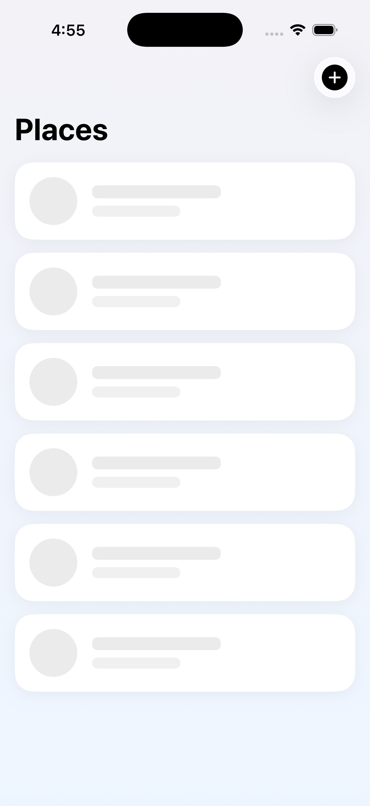
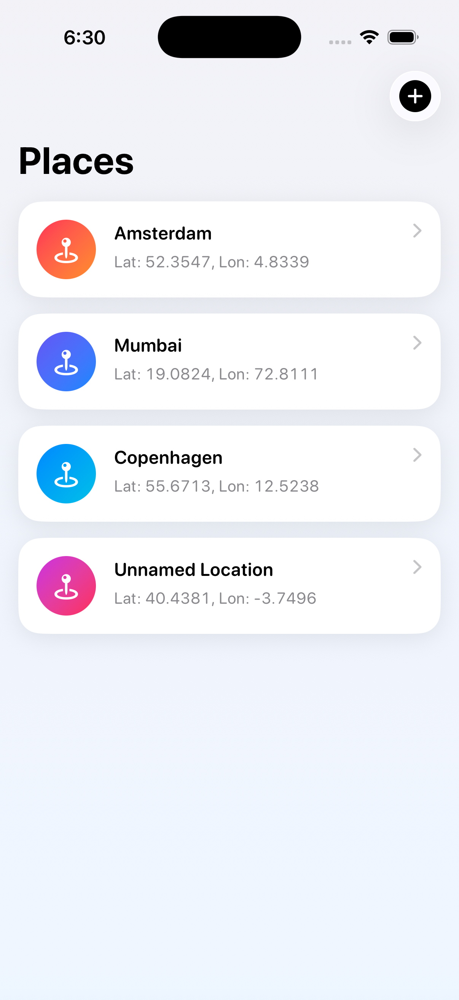
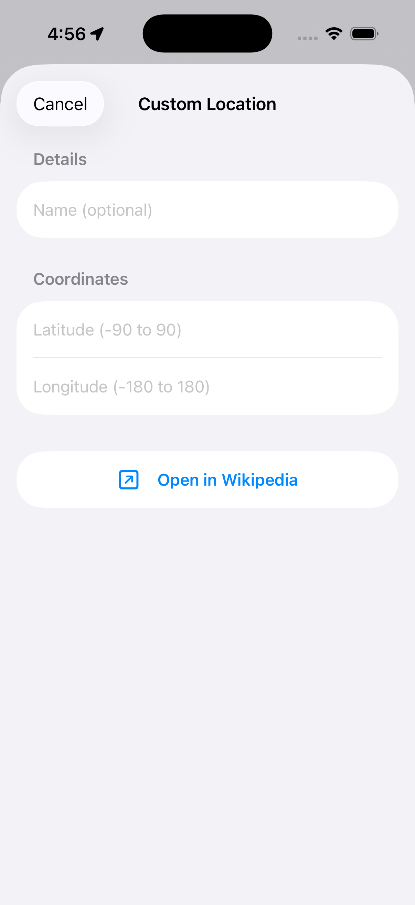
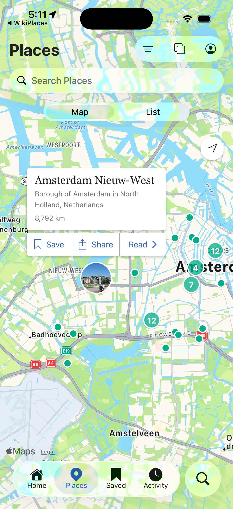
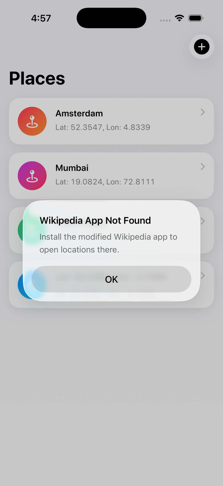

# WikiPlaces

A native iOS app that fetches a [curated list](https://raw.githubusercontent.com/abnamrocoesd/assignment-ios/main/locations.json) of locations and opens each one directly in the [Modified Wikipedia iOS app](https://github.com/tejas786u/wikipedia-ios/tree/LatLong_DeepLinkSupport) using a deep link (`wikipedia://places`).

---

## Getting Started

1. **Clone the repository**
   ```bash
   git clone https://github.com/tejas786u/WikiPlacesApp.git
   cd WikiPlacesApp
   ```

2. **Open in Xcode**
   ```bash
   open WikiPlacesApp.xcodeproj
   ```

3. **Run the app**
   Select an iOS 17+ simulator and press `⌘R`.

4. **Open a location in Wikipedia**
   The app requires the [modified Wikipedia iOS app](https://github.com/tejas786u/wikipedia-ios/tree/LatLong_DeepLinkSupport) to be installed on the same device or simulator. Without it, the app shows a "Wikipedia App Not Found" alert instead of crashing.

---

## Features

- **Location List** - Fetches locations from a remote JSON feed and displays them as interactive cards
- **Staggered Animations** - Location cards slide in from the right, one by one (100 ms stagger for the first 7 cards, immediate for scrolled cards), driven by `onAppear` inside each `LocationCard`; skeleton cards display a shimmer only with no slide; Reduce Motion skips the offset and fades cards in instead
- **Tap Depth Animation** - Tapping a location card scales it down to 93 % with a compressed shadow, then springs back with a subtle bounce before opening Wikipedia - gives a physical "press" feel; skipped entirely when Reduce Motion is on
- **Skeleton Loading** - Animated shimmer placeholder cards while the network request is in flight
- **Error & Empty States** - Distinct views with accessible retry/refresh actions
- **Custom Location** - Enter any latitude/longitude (with an optional name) to open an coordinate in Modified Wikipedia app
- **Local Data Mode** - Flip a single `useLocalData` flag in `DependencyInjector` to load locations from a bundled JSON file instead of the network (useful for offline development and testing)
- **Deep Link Integration** - Opens locations in Modified Wikipedia app via the `wikipedia://places?lat=…&lon=…` URL scheme
- **"App Not Installed" Alert** - Graceful fallback alert when the Wikipedia app is not present on the device
- **Full Accessibility** - VoiceOver labels/hints on all interactive elements, decorative elements hidden from assistive technologies, Reduce Motion respected throughout all animations

---

## Demo

▶️ [Watch App Demo](https://drive.google.com/file/d/13G_RpqTY4HHZ-QMeYY-0ANMytc1_JNUt/view?usp=sharing)

---

## Screenshots

| Skeleton | Location List | Custom Location | Open in Wikipedia | Not Installed Alert |
|:---:|:---:|:---:|:---:| :---: |
|  |  |  |  |  |

---

## Architecture

The app follows **VIP (View–Interactor–Presenter / Clean Swift)** with a protocol-oriented dependency injection layer, organized as two independent **Scenes**: `LocationsList` and `CustomLocation`. Each Scene follows the same unidirectional flow — `View → Interactor (business logic) → Worker (I/O) → Interactor → Presenter (formatting) → View` — with a `SceneBuilder` wiring the stack together and a `Router` handling navigation between Scenes. Interactors and Presenters are `@MainActor`-isolated, ensuring `@Published` mutations always occur on the main thread without manual `DispatchQueue.main` calls. `CustomLocation` owns its own `DeepLinkWorker` and "not installed" alert — it does not depend on the `LocationsList` Scene.

```
┌────────────────────────────────────────────────────────────┐
│                        SwiftUI Views                       │
│  ContentView → LocationsListView                           │
│              → CustomLocationView (sheet, via Router)      │
└───────────────────────┬─────────────────────┬──────────────┘
        request         │                     │  request
┌───────────────────────▼───────┐   ┌─────────▼─────────────────────┐
│     LocationsList Scene       │   │      CustomLocation Scene     │
│  Interactor  (@MainActor)     │   │  Interactor  (@MainActor)     │
│  Presenter   (@MainActor,     │   │  Presenter   (@MainActor,     │
│              ObservableObject)│   │              ObservableObject)│
│  Router → CustomLocationScene │   │  (no Router — no child scenes)│
└──────┬─────────────────┬──────┘   └───────────────┬───────────────┘
       │                 │                          │
┌──────▼────────┐ ┌──────▼──────────┐      ┌────────▼──────────┐
│   Workers     │ │  Workers        │      │  Workers          │
│LocationsWorker│ │DeepLinkWorker   │◄─────┤ DeepLinkWorker    │
└──────┬────────┘ └─────────────────┘      └───────────────────┘
       │
┌──────▼────────┐
│  Networking   │
│ NetworkService│
└───────────────┘
   ▲                                    ▲
   └──────────── DependencyInjector ────┘
      (vends Workers to SceneBuilders)
```

## Project Structure

```
WikiPlacesApp/
├── WikiPlacesApp/
│   ├── WikiPlacesAppApp.swift              # App entry point (@MainActor) — builds the LocationsList scene via SceneBuilder
│   ├── DI/
│   │   └── DependencyInjector.swift        # Factory — vends Workers to SceneBuilders; toggle useLocalData to switch data source
│   ├── Models/
│   │   └── Location.swift                  # Identifiable, Equatable, Decodable
│   ├── Networking/
│   │   └── NetworkService.swift            # Generic URLSession wrapper (transport-layer infra used by LocationsWorker)
│   ├── Services/
│   │   └── DeepLink/
│   │       ├── DLConfiguration.swift       # WikipediaConfig constants
│   │       └── DLBuilder.swift             # WikipediaDeepLink — URL builder
│   ├── Workers/
│   │   ├── LocationsWorker.swift           # LocationsWorker (remote) + LocalLocationsWorker (bundled JSON)
│   │   └── DeepLinkWorker.swift            # DeepLinkWorker — UIApplication bridge
│   ├── Scenes/
│   │   ├── LocationsList/
│   │   │   ├── LocationsListModels.swift       # LocationsListState + Load/OpenLocation Request-Response
│   │   │   ├── LocationsListInteractor.swift   # Business logic — fetch/retry/refresh phase machine, open action
│   │   │   ├── LocationsListPresenter.swift    # ObservableObject — formats Responses into published state
│   │   │   ├── LocationsListRouter.swift       # Routes to the CustomLocation scene
│   │   │   ├── LocationsListSceneBuilder.swift # Wires Interactor + Presenter + Router
│   │   │   ├── LocationsListView.swift         # Scroll container + .task loader
│   │   │   └── Components/
│   │   │       ├── ListContentView.swift       # State-driven switch (loading/loaded/error/empty)
│   │   │       ├── LocationCard.swift          # LocationCard (right→left slide-in, stagger, tap depth animation) + LocationCardSkeleton (shimmer)
│   │   │       └── StatusView.swift            # Reusable error/empty state view
│   │   └── CustomLocation/
│   │       ├── CustomLocationModels.swift      # Validate/Open Request-Response
│   │       ├── CustomLocationInteractor.swift  # Business logic — coordinate validation, deep-link opening
│   │       ├── CustomLocationPresenter.swift   # ObservableObject — formats field errors + alert state
│   │       ├── CustomLocationSceneBuilder.swift# Wires Interactor + Presenter (no Router — no child scenes)
│   │       └── CustomLocationView.swift        # Form sheet for custom lat/lon entry, owns its own alert
│   ├── Root/
│   │   └── ContentView.swift               # Root view — nav stack, sheet (via Router), alert
│   ├── SharedUI/
│   │   ├── BackgroundGradient.swift
│   │   ├── PressableButtonStyle.swift      # Scale + opacity press feedback
│   │   └── ShakeEffect.swift               # GeometryEffect for validation shake
│   └── SupportingFiles/
│       └── LocalTestJSON/
│           └── locations.json              # Bundled fallback data used by LocalLocationsWorker
├── WikiPlacesAppTests/                     # Unit test target
│   ├── DI/
│   │   └── DependencyInjectorTests.swift
│   ├── Models/
│   │   └── LocationTests.swift
│   ├── Networking/
│   │   └── NetworkServiceTests.swift
│   ├── Services/
│   │   └── DLBuilderTests.swift
│   ├── Workers/
│   │   ├── LocationsWorkerTests.swift
│   │   └── DeepLinkWorkerTests.swift
│   ├── Scenes/
│   │   ├── LocationsList/
│   │   │   ├── LocationsListInteractorTests.swift  # Phase-guard semantics, fetch/retry/refresh, open outcomes (spy Presenter)
│   │   │   └── LocationsListPresenterTests.swift   # Response → published state formatting
│   │   └── CustomLocation/
│   │       ├── CustomLocationInteractorTests.swift # Validation rules, boundary values, open() using validatedLocation
│   │       └── CustomLocationPresenterTests.swift  # Response → published error/alert formatting
│   └── Mocks.swift
└── WikiPlacesAppUITests/                   # UI test target
    └── ViewModels/
        ├── LocationsListViewUITests.swift
        └── CustomLocationViewUITests.swift
```

---

## Requirements

| | Minimum |
|---|---|
| iOS | 17.0+ |
| Xcode | 15.0+ |
| Swift | 5.9+ |

## Testing

### Unit Tests — `WikiPlacesAppTests`

Run with `⌘U` (or select the `WikiPlacesAppTests` scheme).

| Folder | File | What is covered |
|---|---|---|
| Models | `LocationTests.swift` | `displayName` fallback, `coordinateString` format, Decodable (`lat`/`long` keys), Equatable |
| Networking | `NetworkServiceTests.swift` | Successful decode, HTTP error → `invalidResponse`, malformed JSON → `decodingError`, cache policy, `URLError` passthrough |
| Workers | `LocationsWorkerTests.swift` | Fetch success, worker-level error, call counts, default and custom endpoint URL |
| Workers | `DeepLinkWorkerTests.swift` | Builder returns nil URL, unregistered scheme, correct location passed to the deep-link builder, repeated calls |
| Services | `DLBuilderTests.swift` | Correct scheme/host, `lat`/`lon` query items, optional `name` inclusion and omission, query item ordering |
| Scenes/LocationsList | `LocationsListInteractorTests.swift` | Phase-guard semantics (`idle → loading → loaded/error`), `loadIfNeeded`/`retry`/`refresh` fetch behavior, open success/failure reported to a spy Presenter |
| Scenes/LocationsList | `LocationsListPresenterTests.swift` | `Response → LocationsListState` formatting, `isShowingNotInstalledAlert` never clears on success |
| Scenes/CustomLocation | `CustomLocationInteractorTests.swift` | Boundary coordinate values, validation error messages, name whitespace trimming, re-validation after first failure, `open()` using the last `validatedLocation` |
| Scenes/CustomLocation | `CustomLocationPresenterTests.swift` | `Response → latitudeError/longitudeError` formatting, `isValid` derivation, alert formatting |
| DI | `DependencyInjectorTests.swift` | Factory returns non-nil Workers for both `makeLocationsWorker()` and `makeDeepLinkWorker()` |

### UI Tests — `WikiPlacesAppUITests`

Run with `⌘U` against the `WikiPlacesAppUITests` scheme.

| File | What is covered |
|---|---|
| `LocationsListViewUITests.swift` | Navigation title present, add-location button exists and is enabled, content list visible after load, error state retry button tappable, empty state refresh button tappable |
| `CustomLocationViewUITests.swift` | Sheet opens on button tap, all form fields present, cancel dismisses the sheet, submitting empty fields shows validation errors, full flow with Wikipedia-not-installed alert |

### Test Mocks — `Mocks.swift`

| Mock | Purpose |
|---|---|
| `MockLocationsWorker` | Stubs `fetchLocations()` with a configurable success or failure |
| `MockDeepLinkWorker` | Stubs `openDeepLink()`, records call count and last location passed |
| `MockLocationsListPresenter` | Spy conforming to `LocationsListPresentationLogic` — records every `presentLoading`/`presentLoad`/`presentOpenResult` call for Interactor tests |
| `MockCustomLocationPresenter` | Spy conforming to `CustomLocationPresentationLogic` — records every `presentValidation`/`presentOpenResult` call for Interactor tests |
| `MockNetworkService` | Generic `fetch<T>()` stub using `Any` result casting |
| `MockURLProtocol` | Intercepts `URLSession` requests for `NetworkService` integration tests |

---

## Accessibility

| Feature | Implementation |
|---|---|
| VoiceOver labels | All interactive elements have explicit `accessibilityLabel` and `accessibilityHint` |
| Decorative elements | Background gradient and icon images are marked `.accessibilityHidden(true)` |
| Button independence | Error/empty state action buttons are **not** merged with surrounding text - they remain independently activatable by VoiceOver |
| Reduce Motion | Card slide-in stagger (offset skipped, fade only), tap depth animation (scale + shadow skip), skeleton shimmer, button press scale, validation shake, and status view pop-in all skip their animations when `accessibilityReduceMotion` is enabled |

---

## Deep Link Format

```
wikipedia://places?lat={latitude}&lon={longitude}[&name={name}]
```

**Example:**
```
wikipedia://places?lat=52.3676&lon=4.9041&name=Amsterdam
```

The `wikipedia` URL scheme is registered in `Info.plist` under `LSApplicationQueriesSchemes` so `UIApplication.canOpenURL(_:)` works correctly before attempting to launch the app.

---

## Data Source

Locations are fetched from:
```
https://raw.githubusercontent.com/abnamrocoesd/assignment-ios/main/locations.json
```

---

## License

This project was created as part of an iOS take-home assignment.
